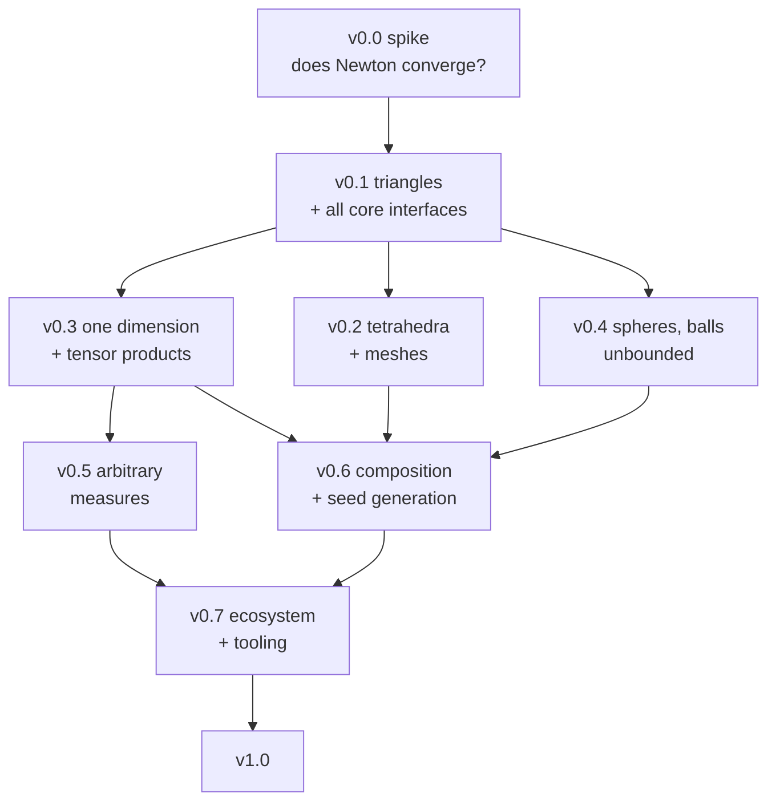

# CubatureRules.jl — Roadmap

The work, laid out. Companion to `PLAN.md`, which holds the design; this file holds the
order, the task lists and the conditions for calling each stage done.

Section references (§2.5, §6 Tier 3, …) point into `PLAN.md`.

---

## How this is ordered

Three rules decide what comes when.

**The first release is the thing that cannot be obtained elsewhere.** Arbitrary-precision
refined symmetric simplex rules on triangles. This is not the easiest starting point; it is
chosen because it forces the hardest machinery — orbit algebra, invariant bases, the
rank-revealing refiner, guard-digit policy — to be built while abandoning the project is
still cheap. A first release built from the easy 1D families would duplicate
`QuadratureRules.jl` and `QuadGK.jl` (§0.1) and prove nothing.

**Interfaces are settled first, but against a real case.** The type hierarchy and the
family interface are v0.1 work and must be right before thirty families bake in a wrong
assumption. They are not, however, designed in the abstract: every type in §2 is exercised
by the triangle cornerstone in the same release. A hierarchy that has never had a hard rule
pushed through it is a guess.

**No dates.** Ordering is by dependency and by value. Each stage has exit criteria instead
of a duration; a stage is done when its criteria pass, not when a calendar says so.

---

## Dependency structure

v0.3 and v0.4 are independent of v0.2 and of each other — all three need only the v0.1
core. If motivation or need reorders them, nothing breaks. v0.2 comes second here because
tetrahedra are where the orbit algebra either scales or does not, and that is the question
most worth answering early.

---

## Decision gates

Five points where a result changes what gets built, rather than just when.

| Gate | Question | If yes | If no |
|---|---|---|---|
| End of v0.0 | Does Newton converge reliably from published seeds? | Proceed as written | Roadmap is wrong from v0.1; rewrite before building |
| End of v0.0 | Does multistart from orbit structure alone work? | Ship MIT-licensed seeds from v0.1; §0.2 stops being a constraint | Seeds stay licence-encumbered until v0.6 node elimination |
| End of v0.0 | Does cond(J) stay manageable to degree ~20? | Fixed guard-digit headroom is fine | Adaptive guard from κ is mandatory, and a degree ceiling gets documented per family |
| During v0.1 | Is `subtypes` discovery sound across a precompilation boundary? | Registry as designed (§2.5) | Fall back to explicit append-only registration; everything else in §2.5 survives |
| Early v0.2 | Does the $S_4$ moment system stay tractable at degree ~15? | Tetrahedra as planned | Cap seeded tet degrees, lean on conical products, move node elimination earlier |

---

## v0.0 — Feasibility spike

**Not a release.** A throwaway script, deleted afterwards. Its only product is an answer.

**Goal.** Establish that the central assumption of the whole plan holds before any package
code depends on it: that Newton on an orbit moment system converges reliably from a
published double-precision seed.

**Work**

- [x] Hard-code the orbit structure and `Float64` table for one published rule —
      Xiao–Gimbutas degree 10 on the reference triangle *(done without published numbers:
      see `notes/v0.0-spike.md`)*
- [x] Write the $S_3$-invariant moment equations by hand, with exact rational right-hand
      sides from the Dirichlet integral formula
- [x] Newton to 100 digits in `BigFloat`; record iteration count and residual per step
- [x] Estimate and log cond(J) at each iteration
- [x] Repeat at degrees 4, 10, 16, 20 — the point is the *growth* of cond(J), not one value
- [x] Repeat degree 10 from 50 random starting points with only the orbit structure fixed;
      record how many converge to a valid rule (positive weights, interior nodes)
- [x] Time one refinement at 100 and at 200 digits

**Exit criteria**

- [x] A one-page note answering four questions: does it converge, how fast does cond(J)
      grow with degree, does multistart recover the rule without the table, what does one
      refinement cost
- [x] Each of the three v0.0 decision gates above resolved

---

## v0.1 — Cornerstone: triangles at arbitrary precision

**Goal.** `rule(Simplex{2}(); degree = 20, digits = 200)` returns a verified, minimal-point
Xiao–Gimbutas rule — an object that exists nowhere else — and every core interface in §2 is
settled by having carried it.

**Unblocks.** Everything. No later stage adds a new core abstraction; they add domains,
families and tooling on top of what lands here.

### Core types (§2.1–2.4)

- [x] `Domain{D,T}` abstract hierarchy; `Interval`, `Simplex{D,T}` concrete. Others stubbed
      with a clear "not yet" error
- [x] `WeightedDomain{D,T,B<:Domain{D,T},W}` — concrete base parameter, no abstract field
- [x] `ExactnessClaim`: `PolynomialDegree`, `SpanOf`, `NoClaim`
- [x] `QuadratureRule{D,T,Dom,C,S,W}` with storage as a type parameter
- [x] `static(rule)` → `SVector`-backed, `isbits`, provenance moved to a type parameter
- [x] `Provenance`: family, derivation path, seed source, citation, licence, selection record
- [x] `Certificate`: defining-equation residual, precision used, cond(J) estimate, guard digits
- [x] `Verification`: basis used, max residual, sharpness result, method, empirical flag
- [x] `derivation(f)` → `Derived()` | `Seeded()`
- [x] 1D specialisation storing `Vector{T}` rather than `Vector{SVector{1,T}}`

### Domain machinery

- [x] Reference simplex, vertices, measure
- [x] Affine maps; `map_to` **restricted to affine at the type level** (§2.3)
- [x] Exact rational monomial moments over a simplex in any $d$ via the Dirichlet formula
- [x] Point-in-domain predicates with a documented tolerance policy
- [x] Barycentric ↔ Cartesian conversions in generic arithmetic

### Symmetry and orbit algebra (§6 Tier 3)

- [x] Orbit types for $S_3$ on the triangle: centroid (weight only), 3-point vertex-type
      $(a,w)$, 6-point general $(a,b,w)$
- [x] Orbit → nodes/weights expansion, exact under the group action
- [x] $S_3$-invariant polynomial basis, hard-coded, **with a Molien-series test** verifying
      the dimension count at each degree
- [x] Moment-equation assembly: invariant basis × orbits → residual and Jacobian
- [ ] Orbit-structure catalogue as data, separate from any numeric table (§0.2)
      *(structures are stored alongside their seeds in `triangle_s3_seeds.toml`)*

### Refinement (§1, §2.7)

- [x] Generic Newton with line search, over arbitrary `Real`
- [x] Gauss–Newton / Levenberg–Marquardt with a **rank-revealing solve** as the default
      path for minimal rules, not a fallback
- [x] Per-iteration cond(J) estimate
- [x] Guard digits set adaptively from cond(J); both recorded in the `Certificate`
- [x] Cancellation token checked once per iteration (needed by v0.7, cheap now, expensive
      to retrofit — §4.2)
- [x] Seed sources behind one interface: published table, orbit structure + multistart,
      lower-degree rule of the same family *(`TableSeed`, `ExplicitSeed`, `MultistartSeed`,
      `LowerDegreeSeed`)*
- [x] Divergence policy: flag in the registry, never silently return an unrefined seed

### Families

- [x] `GaussJacobi` 1D via Newton on the three-term recurrence — included only because the
      conical product needs it
- [x] `GrundmannMöller` on any $d$, odd degree, exact `Rational{BigInt}`
- [x] `ConicalProduct{GaussJacobi}` on any $d$ — the always-available fallback
- [ ] `XiaoGimbutas` on triangles, seeded and refined, across its published degree range
      *(degrees 1–20 shipped; 21–50 need confirmed minimal point counts)*

### Registry (§2.5)

- [x] `subtypes`-based discovery, recursive through abstract layers, **never cached in a
      `const`**
- [x] `candidates(::Type{F}, domain, claim)` returning instances; empty means not applicable
- [x] Combinator recursion (`ConicalProduct` over leaf families), bounded to nesting depth 1
- [x] `npoints`, `properties`, `degree_range`, `cost_estimate`, `derivation` per family
- [x] Deterministic ranking: node count, then derived-before-seeded, then family name —
      explicitly sorted, because `subtypes` traversal order is unspecified
- [x] `rule(domain; degree, T/digits, positive, interior, family)`
- [x] `rule(domain)` with no degree errors, listing candidates and ranges
- [x] `available(domain; degree, filters)` and `compare(domain, degree)`
- [x] Unsatisfiable requests produce the nearest-alternatives diagnostic (§2.5)
- [x] A downstream test package defines a family and is discovered with no registration step

### Application (§3.1)

- [x] `integrate(f, rule)` with generic accumulation — `mapreduce` and an explicit
      `zero(typeof(w[1]*f(x[1])))`, not `sum(w .* f.(x))`
- [x] `integrate(f, rule, domain)` over the affine map
- [x] `batch = true` variant calling `f` once with the full node matrix
- [x] Hot path runs on `static(rule)`; verified zero-allocation with `@allocated`

### Verification (§8)

- [x] `verify` dispatching on the claim type
- [x] Koornwinder–Dubiner orthogonal basis on the triangle (not monomials — they produce
      false failures above degree ~15)
- [x] Exactness at claimed degree, residuals at 2× the rule's precision
- [x] Sharpness: **not** exact at degree $d+1$
- [x] Structural invariants: $\sum w$ = measure, nodes interior, symmetry group preserved
      exactly, positivity where claimed
- [x] Claim-preservation tests for `map_to`, `subdivide`, `transform`, `duffy` — including
      that the last two report `NoClaim`
- [x] `check(rule)` as a public entry point
- [x] Property-based testing over `(family, degree, T)` with `Supposition.jl`

### Presentation

- [x] `show(::QuadratureRule)` printing the full block in §3.5, naming *which* residual it
      reports
- [x] `cite(rule)` → BibTeX, APA, plain
- [x] `hash`, `==`, `isapprox`

### Infrastructure

- [x] `src/data/PROVENANCE.toml` and the CI check that fails on any unrecorded data file
- [x] Reproducibility CI job: rule hashes compared across two Julia versions and two
      platforms (§5 item 9) *(every CI cell checks `test/reference_hashes.toml`: Julia 1.10
      and 1.x on Linux, Windows and macOS)*
- [x] `benchmark_construction(domain; degrees, T, digits)` — the performance regression
      test, tracked from the start
- [x] Number types in CI: `Float64`, `BigFloat` at several precisions, `Double64`,
      `Rational{BigInt}` for exact families
- [x] Documentation site live; **first example is the explicit two-line form**
      (`integrate(f, rule(domain; degree = 20))`) *(live at
      https://ilianpihlajamaa.github.io/CubatureRules.jl/)*
- [x] `using CubatureRules` under one second

**Exit criteria**

- [x] `rule(Simplex{2}(); degree = 20, digits = 200)` returns an XG rule that verifies sharp
      at degree 20 and fails at 21
- [x] All three triangle families verify across their full declared degree range
- [x] `available(Simplex{2}(); degree = 17)` ranks XG, Grundmann–Möller and conical product
      correctly by node count
- [x] Identical `rule(...)` calls produce bitwise-identical output across Julia versions and
      platforms in CI
- [x] A test package adding a family is found by the selector without registration
- [x] Every shipped data file has a provenance entry
- [x] Zero allocations in the `static` inner loop

**Stage risks**

The orbit algebra is the crux (§11). If v0.0 passed, the remaining risk is engineering
rather than mathematics — but the invariant-basis and rank-revealing-solve work is where
schedule slips will come from, not the type hierarchy.

---

## v0.2 — Tetrahedra and meshes

**Goal.** The same guarantee in three dimensions, plus the performance story that makes the
package usable in a real FEM or BEM code.

**Unblocks.** The primary user (§0.3). Also answers whether the orbit approach scales,
which governs how much of Tier 3 is reachable at all.

### Orbit algebra in 3D

- [x] Orbit types for $S_4$ on the tetrahedron
- [x] $S_4$-invariant basis, with the same Molien dimension check
- [ ] Establish the feasibility numbers §6 Tier 3 asks for: free-parameter count at degree
      15, Jacobian density and structure, cost of one refinement at 200 digits
- [x] Extend the exact-moment machinery to $d = 3$ (already generic — needs tests, not code)

### Families

- [ ] `XiaoGimbutas` on tetrahedra, across its published range
- [ ] `WitherdenVincent`
- [ ] `JaskowiecSukumar`
- [ ] `Dunavant`, `ZhangCuiLiu` where they add coverage the others lack
- [x] `GrundmannMöller` and `ConicalProduct` verified at $d = 3, 4$

### Mesh integration (§3.2)

- [x] `integrate(f, rule, mesh)` batched over cells, rule constructed once
- [x] Threaded variant behind a keyword
- [x] `subdivide(r, domain, n)` composite rules *(intervals, triangles, and tetrahedra by
      repeated bisection)*
- [ ] A mesh interface shaped for `Meshes.jl` without taking the dependency yet

### Performance

- [x] Benchmark the mesh path against a hand-written FEM kernel — this is the acceptance
      test, not a nice-to-have
- [ ] Check the `BigFloat` $n \sim 500$ risk (§11) with `benchmark_construction`
- [ ] Profile and fix the generic eigensolver path where a Newton-on-recurrence path exists

**Exit criteria**

- [ ] A degree-15 tetrahedron rule at 100 digits, verified sharp
- [x] Integration over $10^6$ triangles within a small constant factor of a hand-written
      kernel, with zero allocations
- [x] Verification basis extended to 3D (Koornwinder–Dubiner on the tetrahedron)
- [ ] The Tier 3 feasibility numbers written down and published in the docs

---

## v0.3 — One dimension, completed and delegated

**Goal.** Full 1D coverage with as little of it written here as possible, and the registry
gaining enough breadth for the selector to be genuinely discriminating.

### Delegation (§0.1)

- [x] Decide and take the dependency: `QuadratureRules.jl` for the families it covers,
      `QuadGK.gauss` / `QuadGK.kronrod` for arbitrary-weight and Kronrod rules *(QuadGK is a
      hard dependency; QuadratureRules is weak — it costs a second to load — and its
      families switch on when the user loads it)*
- [x] Conversion at the boundary into this package's `QuadratureRule` type, with provenance
      recording the upstream source
- [ ] Open the upstream conversation; contribute generalised Gauss–Jacobi, Laguerre,
      Hermite, exact-rational Newton–Cotes, Fejér 2, Patterson where they fit that scope

### Families filled here

- [x] Gauss–Laguerre and Gauss–Hermite, generalised
- [x] Radau and Lobatto variants via Golub's modified Jacobi matrix *(delegated to
      QuadratureRules.jl rather than reimplemented)*
- [x] Clenshaw–Curtis and Fejér 1 & 2, closed-form weights / generic DCT *(Clenshaw–Curtis
      delegated; Fejér 1 and 2 implemented here, as upstream lacks them)*
- [x] Newton–Cotes closed and open, exact `Rational{BigInt}`
- [ ] Gauss–Patterson nested extension *(deferred to v0.5: only the first extension of a
      Gauss rule is a Kronrod rule, which QuadGK supplies; iterating it means extending a
      rule that is no longer Gauss, which needs the Stieltjes machinery below)*
- [x] Tanh-sinh, exp-sinh, sinh-sinh — the `NoClaim` path, with convergence-sweep
      verification

### Composition

- [x] `Orthotope` domain
- [x] `TensorProduct` over any 1D families; conservative total-degree claim (§2.2)
- [x] `r₁ ⊗ r₂`
- [x] `RuleSequence` for nested families (§3.3)
- [x] Embedded error estimates at zero extra evaluations, generalised beyond Kronrod
      *(`EmbeddedRule` pairs any rule with a coarser one on a subset of its nodes; Kronrod
      and nested Fejér 2 both work)*
- [x] `integrate(f, domain; rtol)` order-adaptive, returning `IntegrationResult` (§3.4)

**Exit criteria**

- [ ] `available(Orthotope{3}(); degree = 11)` offers tensor and non-tensor candidates,
      ranked *(ten tensor candidates, ranked; the non-tensor half waits on Smolyak, below,
      since no non-tensor box family exists yet — carried to v0.6)*
- [x] Nested sequences produce error estimates with no additional integrand calls
      *(`EmbeddedRule` over Kronrod, nested Fejér 2, tanh-sinh, exp-sinh and sinh-sinh; the
      test counts the evaluations)*
- [x] `NoClaim` verification by convergence sweep works and is flagged empirical in the
      `Verification`
- [x] No 1D family is implemented here that an upstream package already provides *(the
      exceptions are deliberate and documented: Fejér 1 and 2, exact-rational
      Newton–Cotes, the double-exponential family under this package's precision policy,
      and Gauss–Laguerre/Hermite, none of which upstream covers)*

---

## v0.4 — Spheres, balls, unbounded domains

**Goal.** The remaining classical domains, and the first `WeightedDomain` families.

- [x] `Sphere{D,T}`; measures and monomial moments over $S^{d-1}$ *(the moments are
      rational multiples of $\pi^{\lceil D/2\rceil}$, so they are exact to the working
      precision rather than exact rationals)*
- [ ] `Ball{D,T}`, disk
- [x] Spherical-harmonic basis for verification *(real harmonics on $S^2$ and the Fourier
      basis on the circle; $S^{d-1}$ for $d > 3$ needs hyperspherical harmonics and says so)*
- [x] Product rules: Gauss–Legendre in $\cos\theta$ × trapezoid in $\varphi$
- [ ] Jacobi radial weight, for the ball
- [ ] Octahedral orbit algebra; `Lebedev` seeded and refined to arbitrary precision
- [ ] Womersley $t$-designs
- [ ] Stroud $E_n^{r^2}$, $E_n^{r}$, $S_n$, $T_n$ in closed form for arbitrary $d$
- [x] `WeightedDomain` instances: `HermiteLine`, `LaguerreRay` *(pulled into v0.3 with
      Gauss–Laguerre and Gauss–Hermite)*
- [x] Unbounded-domain handling in `integrate` and in verification *(pulled into v0.3:
      `RecurrenceBasis` verifies against the weight's own orthonormal polynomials)*

**Exit criteria**

- [ ] A Lebedev rule at order 131 refined to 100 digits and verified against spherical
      harmonics
- [ ] $t$-designs verified as `PolynomialDegree(t)` claims, confirming the §2.2 collapse

---

## v0.5 — Arbitrary measures

**Goal.** The OPQ layer, scoped strictly to what QuadGK and PolyChaos do not already cover
(§6 Tier 2), plus the singular and oscillatory catalogue.

- [ ] Modified Chebyshev from modified moments — **the headline**, and the demonstration
      that 200-digit arithmetic makes a "too ill-conditioned" algorithm usable
- [ ] Christoffel modification: multiply or divide the weight by a linear factor
- [ ] Gauss–Patterson, carried over from v0.3: iterated Kronrod extension on top of the
      Stieltjes polynomials
- [ ] Multiple-component discretisation (`mcdis`)
- [ ] Singular weights: $\log(1/x)$, algebraic-logarithmic endpoint singularities
- [ ] Cauchy principal value and Hadamard finite-part rules via analytic modified moments
- [ ] Oscillatory weights: Filon-type rules as `PolynomialDegree` on an oscillatory
      `WeightedDomain`, complex `T`, with the small-$\omega$ cancellation handled by a
      series branch or extra guard digits

**Exit criteria**

- [ ] A documented worked example where moment-based Chebyshev fails in `Float64` and
      succeeds at 200 digits — this is the package's best single argument
- [ ] No reimplementation of Stieltjes or Lanczos; both delegated or contributed upstream

---

## v0.6 — Composition and seed generation

**Goal.** The remaining domains, and the start of generating seeds rather than borrowing
them.

### Composition

- [ ] Smolyak sparse grids: combination technique with node deduplication, any 1D family
      *(also closes the v0.3 exit criterion that `available` on a box offer a non-tensor
      candidate)*
- [ ] `Wedge`, `Pyramid`
- [ ] `Polytope` via Lasserre / Chin–Sukumar divergence-theorem reduction — **Tier 1b**,
      declaring `interior = false` in `properties` so the selector filters it honestly
- [ ] `transform(r, φ, Jφ)` and `duffy(r)`, both returning `NoClaim` (§2.3)
- [ ] Composite and subdivided rules across all domains

### Seed generation (§6 Tier 4)

- [x] Node elimination: drop the lowest-weight orbit, Gauss–Newton the remainder back onto
      the moment variety, accept on positive weights and interior nodes, repeat
      *(pulled forward into v0.2 by the $S_4$ gate; `src/refine/elimination.jl` also merges
      an orbit's coordinates into a smaller orbit type, and grows a rule from the degree
      below)*
- [ ] Robustness tuning and a compute budget — the hard parts are these, not the mathematics
      *(multi-chain driver done; no compute budget yet)*
- [ ] Target: an MIT-licensed seed table for at least one domain where the literature runs
      out, which both extends coverage and unwinds the §0.2 dependency

**Exit criteria**

- [ ] At least one shipped seed table generated in-house and MIT-licensed
- [ ] Polytope rules present, correctly declared as boundary-node rules, and rejected by an
      `interior = true` request

---

## v0.7 — Ecosystem and tooling

**Goal.** Everything that makes the package pleasant, comparable and embeddable. Deferred to
here because most of it needs breadth to be meaningful.

### Benchmark harness (§4)

- [ ] `benchmark(f, domain; ...)` with all five budgets, returning a `Tables.jl` table
- [ ] `status` reasons: `:completed`, `:time_budget`, `:point_budget`, `:precision_budget`,
      `:diverged`, `:unsupported`
- [ ] Budget enforcement by escalate-and-check between degrees, plus the cancellation token
      already built in v0.1
- [ ] Warm-up per family before timing; honest single-sample recording where that is all
      that is affordable
- [ ] `reference = :auto` with structurally-independent cross-check and a loud warning on
      disagreement
- [ ] Two-panel plot (error vs npoints | error vs construction time), log–log, distinct
      markers for negative weights and exterior nodes, open terminal markers for truncation
- [ ] The non-generalisability caveat in the docs *and* the plot subtitle

### Extensions

- [ ] `IntegralsExt` — SciML `solve` interface
- [ ] `MeshesExt` — take the dependency the v0.2 interface was shaped for
- [ ] `MakieExt`, `PlotsExt` — `plot(rule)` node visualisation and `plot(b)`
- [ ] `ArbNumericsExt` — certified rules, rigorous node/weight enclosures
- [ ] `UnitfulExt` — with a real test, since it does not fall out entirely free (§5 item 11)
- [ ] `ForwardDiffExt` — see below
- [ ] `SymbolicsExt`

### Differentiable rules (§7)

- [ ] Implicit-function-theorem derivative rules, **one per family**, derived from that
      family's defining equations
- [ ] Explicit tests that nobody is differentiating through the Newton iteration

### Emission

- [ ] `emit(rule, :julia | :c | :cuda)` with full-precision literals
- [ ] `latex(rule)` and exact rational output for the algebraic families

**Exit criteria**

- [ ] A benchmark run across every family on a simplex produces a correct Pareto frontier
      with truncations drawn as truncations
- [ ] A 30-digit rule emitted to C compiles and reproduces its nodes to the last bit
- [ ] AD through `rule(...)` matches finite differences for at least one family per tier

---

## v1.0 — Stable

- [ ] API freeze on the query interface: `rule`, `available`, `compare`, `integrate`,
      `verify`, `cite`. Rule families stay open for extension
- [ ] ≥95% test coverage
- [ ] Complete provenance manifest, every entry checked
- [ ] Registered under an organisation — JuliaMath or JuliaApproximation — not a personal
      account (§11, bus factor)
- [ ] CONTRIBUTING guide whose central section is "how to add a rule family": one type, one
      `candidates` method, its metadata, a `verify` method, a provenance entry
- [ ] JOSS or arXiv paper

### The two paper candidates

Both fall out of work already done, and either is a stronger hook than "we wrote a package".

1. **The wrong-tables artifact** (§8). A systematic pass refining and verifying every
   published table produces a list of rules that do not survive: transcription errors,
   claimed degrees that are wrong, rules asserted minimal that are not. Costs nothing beyond
   Tier 3.
2. **Generalised Gaussian quadrature for singular BEM kernels** (§6 Tier 5). The flagship
   application, and the one place the thesis is structurally rather than quantitatively
   true.

---

## Cross-cutting work

Not a stage. Applies to every release, and the CI enforces most of it.

| Discipline | Enforcement |
|---|---|
| Every data file has a provenance entry | CI fails the build otherwise (§0.2) |
| Every family declares a claim type and has a `verify` method | A family without one does not ship (§8) |
| Every composition operation states its effect on the claim | Tested in the claim-preservation suite (§2.3) |
| `rule(...)` is bitwise reproducible | Dedicated CI job across Julia versions and platforms (§5 item 9) |
| Construction cost is tracked | `benchmark_construction` in CI from v0.1, trended over time |
| `subtypes` is never cached in a `const` | Lint rule or a test that adds a family at runtime and asserts discovery |
| Docs page per family, with its citation and degree range | Part of the definition of done for any new family |

---

## Cheap wins: earliest sensible release

From §5. Ship these as the core allows rather than batching them — several make the early
releases substantially more pleasant.

| Win | Earliest | Note |
|---|---|---|
| `show` with the full block | v0.1 | Makes correctness inspectable from day one |
| `cite(rule)` → BibTeX | v0.1 | Provenance is already stored |
| `npoints` / `cost_estimate` without construction | v0.1 | The selector needs them anyway |
| Diagnostic on unsatisfiable request | v0.1 | Error messages that teach the domain |
| `hash`, `==`, deterministic construction | v0.1 | Cheap to design for, expensive to retrofit |
| `check(rule)` on demand | v0.1 | Makes verification a public feature |
| `@test_exact` macro | v0.1 | For users' own test suites |
| Exact rational output | v0.1 | Free for Grundmann–Möller; extends with Newton–Cotes in v0.3 |
| Node visualisation | v0.2 | Needs a plotting extension; excellent README material |
| Embedded error estimates | v0.3 | Needs nested families |
| `latex(rule)` | v0.3 | Pairs with exact rationals |
| Code emission | v0.7 | Or earlier if a FEM user asks — it is string formatting |
| `Integrals.jl` backend | v0.7 | One adapter file |
| Unitful support | v0.7 | With a real test, not assumed free |

---

## Deliberately not scheduled

Recorded so these are omissions by decision rather than oversight.

- **Error theory** — Peano kernel constants, Bernstein-ellipse bounds, asymptotic orders in
  $\omega$, double-exponential convergence rates. Revisit after v0.4. Until it exists, these
  live in prose and not in the type system (§6, acknowledged gaps).
- **Moment fitting for cut cells** — valuable, not small.
- **Adaptive space-subdividing integration** — that is `QuadGK.jl`, `HCubature.jl`,
  `Integrals.jl`, `HAdaptiveIntegration.jl`. Integrate with them.
- **QMC and lattice rules** — a different subject. Point at `QuasiMonteCarlo.jl`.
- **Gauss–Turán and derivative-consuming rules** — needs its own rule type (§2.2), not a
  widening of `QuadratureRule`. Post-1.0.
